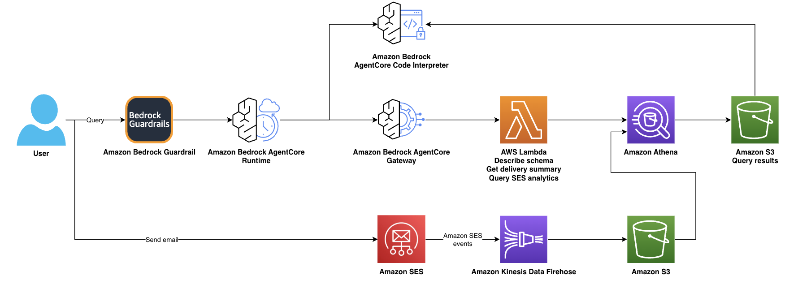

# Amazon Simple Email Service (Amazon SES) Insights' Agent

A CDK-deployed analytics platform for Amazon SES that combines a serverless data pipeline (Firehose → S3 Parquet → Glue → Athena) with an AI-powered agent exposed through an AgentCore MCP Gateway. Ask questions in natural language, get SQL-backed answers, and run exploratory data analysis with a sandboxed Code Interpreter that generates pandas insights and matplotlib charts — all from any MCP-compatible client. The pipeline also works standalone with Athena for direct SQL access.

## Architecture



### Large Dataset Flow

For queries returning more than 500 rows, the system avoids passing data through
the agent's context window. Instead, the Code Interpreter downloads results
directly from S3:

```
User prompt
    → Agent writes SQL
    → Gateway Lambda runs Athena query
    → Athena writes full CSV to S3 (automatic)
    → Lambda returns preview (10 rows) + S3 URI to agent
    → Agent sends code to Code Interpreter
    → Code Interpreter downloads CSV from S3 via aws s3 cp (IAM role)
    → pandas analysis + matplotlib chart
    → base64 PNG streamed back to client
```

For small results (≤500 rows), data is returned inline as JSON — no S3 hop needed.

## What's Included

| Component | Description |
|-----------|-------------|
| Analytics Pipeline | SES → Firehose → S3 Parquet → AWS Glue → Athena with auto-partitioning |
| Pre-built Views | `daily_summary`, `bounce_analysis`, `sender_reputation`, `hourly_volume` |
| Scheduled Maintenance | Daily MSCK REPAIR TABLE + view refresh (2 AM UTC) |
| MCP Gateway | 3 tools: `query_ses_analytics`, `describe_ses_schema`, `get_delivery_summary` |
| AgentCore Runtime | Strands agent with NL→SQL, Code Interpreter for EDA |
| Custom Code Interpreter | S3-enabled sandbox for large dataset analysis (up to 5 GB via `aws s3 cp`) |
| Test Client | Python CLI with SigV4 auth for interactive testing |
| Sample Data Script | Send test emails via SES Mailbox Simulator for immediate testing |

## Deployment Modes

| Mode | Config | What's Deployed |
|------|--------|-----------------|
| Full (default) | `enableRuntime: true, enableGateway: true` | Pipeline + Gateway + Agent |
| Gateway only | `enableRuntime: false, enableGateway: true` | Pipeline + Gateway tools |
| Pipeline only | `enableRuntime: false, enableGateway: false` | Pipeline + Athena (no AI) |

Pipeline-only mode is useful if you just want the SES analytics data lake and plan to query Athena directly.

## Prerequisites

- AWS CDK v2 (`npm install -g aws-cdk`)
- AWS credentials configured
- Node.js 18+ and Python 3.11+
- Docker (for CodeBuild container builds, only if `enableRuntime: true`)
- CDK bootstrapped in your account/region

## Quick Start

```bash
# Install dependencies
npm install

# Prepare the Lambda layer
mkdir -p lambda-layer/python
pip3 install boto3 botocore -t lambda-layer/python/ --upgrade

# Deploy
cdk bootstrap   # if not already done
cdk deploy

# Seed sample data (interactive CLI — requires a verified SES identity)
python3 scripts/seed_sample_data.py

# Test (wait ~2 min for Firehose buffer to flush)
cd test-client
pip3 install -r requirements.txt
python chat.py --region us-east-1
```

> **Note:** On macOS with Homebrew Python, system-wide pip installs are blocked.
> Use a virtual environment instead:
>
> ```bash
> cd test-client
> python3 -m venv .venv
> source .venv/bin/activate
> pip install -r requirements.txt
> python chat.py --region us-east-1
> ```

## Connecting Your Existing SES

The pipeline captures events from a SES Configuration Set. By default, the stack
creates a new one. If you already have a configuration set, set
`createConfigurationSet: false` in `cdk.json` and put your existing name in
`sesConfigurationSetName` — the stack will reference it without trying to create it.

To start collecting data, add the configuration set to your SES sending calls.

**boto3 (Python):**
```python
ses = boto3.client('sesv2')
ses.send_email(
    FromEmailAddress='sender@example.com',
    Destination={'ToAddresses': ['recipient@example.com']},
    Content={'Simple': {
        'Subject': {'Data': 'Hello'},
        'Body': {'Text': {'Data': 'World'}},
    }},
    ConfigurationSetName='ses-analytics-config-set',  # ← add this
)
```

**AWS CLI:**
```bash
aws sesv2 send-email \
  --from-email-address sender@example.com \
  --destination '{"ToAddresses":["recipient@example.com"]}' \
  --content '{"Simple":{"Subject":{"Data":"Test"},"Body":{"Text":{"Data":"Hello"}}}}' \
  --configuration-set-name ses-analytics-config-set
```

**SMTP:** Set the `X-SES-CONFIGURATION-SET` header to `ses-analytics-config-set`.

> The configuration set name is output by the stack as `SesConfigurationSetName`.

## Configuration

Edit `cdk.json` context values:

| Key | Default | Description |
|-----|---------|-------------|
| `projectName` | `ses-analytics` | Resource name prefix |
| `stage` | `dev` | Environment stage (`dev` or `prod`) |
| `sesConfigurationSetName` | `ses-analytics-config-set` | SES config set name |
| `createConfigurationSet` | `true` | Set to `false` to use an existing SES Configuration Set instead of creating a new one |
| `modelId` | `us.anthropic.claude-sonnet-4-20250514-v1:0` | Amazon Bedrock model for the agent |
| `enableGateway` | `true` | Deploy MCP Gateway tools |
| `enableRuntime` | `true` | Deploy AgentCore Runtime |
| `firehoseBufferIntervalSeconds` | `60` (dev) / `300` (prod) | Firehose buffer flush interval in seconds (1–900) |
| `firehoseBufferSizeMBs` | `64` | Firehose buffer size in MB (1–128) |
| `guardrailId` | _(none)_ | Optional Amazon Bedrock Guardrail ID for input/output content filtering |
| `guardrailVersion` | `DRAFT` | Guardrail version (required if `guardrailId` is set) |

## Auth & Connectivity

Since everything is CDK-deployed in the same AWS account:

- **MCP Gateway** uses AWS IAM auth — the AgentCore Runtime authenticates via its execution role
- **Gateway tools** (Lambda) have scoped IAM policies for Athena/AWS Glue/S3 — no SES credentials needed
- **Test client** uses your local AWS credentials (SigV4) to invoke the Runtime
- **No API keys to manage** — just AWS IAM

### Connecting from External MCP Clients

The AgentCore Runtime exposes an HTTP endpoint. Any MCP client that supports
AWS IAM SigV4 auth can connect:

```
Endpoint: https://bedrock-agentcore.<region>.amazonaws.com/agent-runtime/<runtime-id>
Auth: AWS SigV4 (service: bedrock-agentcore)
```

## Example Queries

```
"Show me delivery stats for the last 7 days"
"What's my bounce rate this month?"
"List the top 10 recipients with the most bounces"
"Describe the database schema"
"Run an analysis of open rates by day of week"
"Compare complaint rates between last week and this week"
"Show me the sender reputation view"
"Which senders have the highest complaint rate?"
```

### Code Interpreter Example

The agent can run Python analysis and generate charts from your data. After
seeding sample data, try:

```
"Plot my daily bounce rate trend as a line chart"
"Create a bar chart comparing event types (sends vs bounces vs complaints)"
"Analyze the distribution of bounce types and show a pie chart"
"Build a heatmap of hourly send volume"
```

The agent will: query the data via `query_ses_analytics`, pass results to the
Code Interpreter, run pandas/matplotlib analysis, and return the chart. This
works with the seeded simulator data since it generates a realistic mix of
deliveries (~70%), bounces (~20%), and complaints (~10%) across multiple
subjects and time periods.

Charts are saved as PNG files in `test-client/charts/` and the client prints
the file path so you can open them directly (`open charts/chart_xxxx.png` on macOS).

### Large Dataset Analysis

For queries returning more than 500 rows, the agent automatically switches to
the S3-backed workflow. The Code Interpreter downloads the full CSV directly
from S3 using its IAM role — no data passes through the agent's context window.

This supports datasets up to 5 GB (the `aws s3 cp` limit inside the Code
Interpreter sandbox).

**Testing the S3 path with small datasets:**

You can force the S3 path even with small result sets by asking the agent to
use `force_s3: true` in the query tool call. For example:

```
"Query my bounces for the last 7 days and force the S3 path for testing"
```

The agent will pass `force_s3: true` to `query_ses_analytics`, which will
return an S3 URI instead of inline results regardless of row count.

## Pre-built Athena Views

These views are created automatically and refreshed daily:

| View | Description |
|------|-------------|
| `daily_summary` | Daily aggregated metrics: sends, deliveries, bounces, opens, clicks with rates |
| `bounce_analysis` | Bounce breakdown by type and subtype with sample recipients |
| `sender_reputation` | Per-sender metrics: send volume, bounce rate, complaint rate |
| `hourly_volume` | Hourly send/delivery/bounce volume for capacity planning |

Query them directly in Athena or through the agent:
```sql
SELECT * FROM ses_analytics_dev.daily_summary ORDER BY send_date DESC LIMIT 7;
```

## Project Structure

```
├── src/                          # CDK TypeScript
│   ├── app.ts                    # CDK app entry
│   ├── ses-analytics-stack.ts    # Main stack
│   ├── config.ts                 # Configuration
│   └── constructs/
│       ├── analytics-pipeline-construct.ts  # S3+Firehose+AWS Glue+Athena+Views
│       ├── gateway-construct.ts             # MCP Gateway + tool Lambdas
│       ├── runtime-construct.ts             # AgentCore Runtime + Custom Code Interpreter
├── agent/                        # AgentCore container
│   ├── agentcore_runtime.py      # Strands agent with NL→SQL + Code Interpreter
│   ├── Dockerfile
│   └── requirements.txt
├── lambda/
│   ├── analytics/                # Pipeline Lambdas
│   │   ├── create_table.py       # AWS Glue table creation
│   │   ├── partition_manager.py  # Auto-partition on S3 events
│   │   └── scheduled_maintenance.py  # Daily MSCK REPAIR + view refresh
│   ├── gateway-tools/            # MCP Gateway tool Lambdas
│   │   ├── query_ses_analytics.py    # SQL validation + execution
│   │   ├── describe_schema.py
│   │   └── get_delivery_summary.py
│   ├── deployer/                 # Runtime deployment Lambda
│   │   └── index.py
├── scripts/
│   ├── setup.sh                  # One-command setup
│   └── seed_sample_data.py       # Generate test data
├── test-client/                  # Test CLI
│   ├── chat.py                   # Interactive + single-query modes
│   └── requirements.txt
└── lambda-layer/                 # Shared boto3 layer (gitignored)
```

## Security

This project follows the [AWS Shared Responsibility Model](https://aws.amazon.com/compliance/shared-responsibility-model/). AWS is responsible for security *of* the cloud — the physical infrastructure, compute, storage, networking, and facilities that run AWS services. You are responsible for security *in* the cloud — your data, identity and access management, application code, network configuration, and the security configuration of managed services.

### Customer Responsibilities

| Security Domain | What You Manage |
|-----------------|-----------------|
| Credential management | Rotate IAM access keys per your organization's policy, use IAM roles over long-term credentials, never commit credentials to version control |
| IAM policy scoping | Review and scope IAM policies for users/roles accessing analytics data or the agent; use IAM Access Analyzer to identify overly permissive policies |
| Data protection | Classify PII in SES event data (see [Data Classification and Handling](#data-classification-and-handling)); apply field-level masking for email addresses in shared queries |
| Endpoint security | Restrict test client execution to trusted environments; scope `bedrock-agentcore:InvokeRuntime` to specific runtime ARNs and authorized IAM principals |
| Monitoring | Configure CloudWatch alarms for anomalous query volumes or Lambda error rates; review S3 access logs and CloudTrail events for unauthorized access |
| Encryption key management | If upgrading from SSE-S3 to KMS, manage key policies, rotation, and access grants (see [Encryption and Key Management](#encryption-and-key-management)) |
| Dependency maintenance | Keep boto3 layer, agent container base image, and CDK version up to date; enable ECR image scanning |
| Production hardening | Review [Security Guidelines by Service](#security-guidelines-by-service) before promoting to production |

### Implemented Controls

The stack deploys the following controls automatically. Below are the details and how to verify each one.

### 1. SQL Query Validation (lambda/gateway-tools/query_ses_analytics.py)

All queries pass through `validate_sql()` before reaching Athena:

- Only `SELECT`, `SHOW`, `DESCRIBE`, `EXPLAIN`, and `WITH` statements are allowed
- Multi-statement queries (semicolons outside string literals) are rejected
- SQL comments (`--` and `/* */`) are stripped before execution

```python
# The allowlist enforced in query_ses_analytics.py
ALLOWED_PREFIXES = {'SELECT', 'SHOW', 'DESCRIBE', 'EXPLAIN', 'WITH'}

# First keyword must match the allowlist
first_word = cleaned.split()[0].upper()
if first_word not in ALLOWED_PREFIXES:
    raise ValueError(f'Only read queries allowed. Got: {first_word}')

# Semicolons outside string literals are rejected
no_strings = re.sub(r"'[^']*'", '', cleaned)
if ';' in no_strings:
    raise ValueError('Multi-statement queries are not allowed')
```

Verify by invoking the tool with a disallowed statement — it should return an error:
```bash
# Test: this should be rejected
aws lambda invoke --function-name <query-tool-function-name> \
  --payload '{"sql_query": "DROP TABLE ses_events"}' /dev/stdout
# Expected: {"error": "Only read queries are allowed. Got: DROP. Allowed: DESCRIBE, EXPLAIN, SELECT, SHOW, WITH"}
```

### 2. IAM Policy Scoping

All Lambda and runtime roles follow least-privilege. Verify with:

```bash
# List policies attached to a role
aws iam list-attached-role-policies --role-name <role-name>

# Inspect a specific policy version for wildcard resources
aws iam get-policy-version \
  --policy-arn <policy-arn> \
  --version-id $(aws iam get-policy --policy-arn <policy-arn> --query 'Policy.DefaultVersionId' --output text)

# Check that resource ARNs are scoped (not "Resource": "*")
# Gateway Lambdas should only have access to:
#   - The specific Athena workgroup
#   - The specific AWS Glue database and tables
#   - The specific S3 buckets (data + results)
```

### 3. S3 Encryption and Access Controls

All buckets enforce encryption at rest and block public access:

```bash
# Verify server-side encryption is enabled
aws s3api get-bucket-encryption --bucket <bucket-name>

# Verify public access is blocked
aws s3api get-public-access-block --bucket <bucket-name>
# Expected: all four Block* settings should be true

# Verify SSL-only policy (deny HTTP)
aws s3api get-bucket-policy --bucket <bucket-name> --query 'Policy' --output text | python3 -m json.tool
# Look for: "Condition": {"Bool": {"aws:SecureTransport": "false"}}, "Effect": "Deny"
```

### 4. Code Interpreter Isolation

- Runs in `SANDBOX` network mode — no public internet access
- IAM role grants read-only S3 access scoped to the Athena results bucket only

```bash
# Verify the Code Interpreter's network mode
aws bedrock-agentcore-control get-code-interpreter \
  --code-interpreter-identifier <id> \
  --query 'networkMode'
# Expected: SANDBOX

# Verify the Code Interpreter role has only s3:GetObject on the results bucket
aws iam list-attached-role-policies --role-name <code-interpreter-role-name>
```

### 5. Additional Controls

- Sender email parameters are validated against email format regex before SES API calls
- Firehose failed records are backed up to a separate S3 prefix (not silently dropped)
- Athena results bucket has a 30-day lifecycle policy to limit data retention

### Implementation Priority

If deploying to production, verify in this order:

1. S3 encryption and public access blocks (data protection)
2. IAM policy scoping (access control)
3. SQL query validation (injection prevention)
4. Code Interpreter isolation (sandbox integrity)
5. Firehose error handling (data durability)

## Security Guidelines by Service

Prescriptive hardening guidance for each AWS service used in this stack. These go beyond the defaults and are recommended for production deployments.

### SES
- Use a dedicated Configuration Set per environment to isolate event streams
- Enable SES account-level suppression list to automatically stop sending to addresses that bounce or complain
- Restrict `ses:SendEmail` permissions to specific verified identities (not `*`):
  ```json
  { "Effect": "Allow", "Action": "ses:SendEmail", "Resource": "arn:aws:ses:<region>:<account>:identity/<domain>" }
  ```

### Firehose
- Enable server-side encryption on the Firehose delivery stream using SSE-KMS for sensitive email metadata
- Configure CloudWatch Logs for delivery error logging (`DeliveryStream → ErrorOutputPrefix`)
- Set the `BufferingHints` interval to at least 300s in production to reduce S3 PUT costs and improve Parquet file sizes

### S3
- Enable versioning on production data buckets to protect against accidental overwrites
- Use SSE-KMS (instead of SSE-S3) if you need key rotation control or audit trails via CloudTrail
- Add lifecycle rules to transition old data to S3 Glacier after 180 days and expire after your retention policy
- Enable S3 access logging or CloudTrail data events on buckets containing email analytics

### AWS Glue
- Restrict `glue:GetTable` and `glue:GetDatabase` permissions to the specific analytics database, not all databases in the catalog
- Enable encryption at rest for the AWS Glue Data Catalog via the catalog settings in the AWS console
- Use resource-level policies on the AWS Glue catalog to prevent cross-account access unless explicitly needed

### Athena
- Use workgroups to enforce per-query data scan limits (e.g., `BytesScannedCutoffPerQuery: 1073741824` for 1 GB) to prevent runaway costs
- Encrypt query results using SSE-KMS:
  ```bash
  aws athena update-work-group --work-group <name> \
    --configuration-updates '{"ResultConfigurationUpdates":{"EncryptionConfiguration":{"EncryptionOption":"SSE_KMS","KmsKey":"<key-arn>"}}}'
  ```
- Enable CloudTrail logging for Athena API calls to audit who ran which queries

### Lambda
- Set appropriate memory and timeout limits — the gateway tools should not need more than 256 MB / 120s
- Enable AWS X-Ray tracing for latency debugging: set `tracing: lambda.Tracing.ACTIVE` in CDK
- Pin the Lambda runtime version and review dependency updates regularly (the boto3 layer)

### IAM
- Use IAM roles exclusively — never embed long-term credentials in code or environment variables
- Review roles periodically with IAM Access Analyzer:
  ```bash
  aws accessanalyzer list-findings --analyzer-arn <analyzer-arn> --filter '{"resourceType":{"eq":["AWS::IAM::Role"]}}'
  ```
- Scope trust policies on Lambda execution roles to the specific Lambda service principal and account

### AgentCore
- Restrict `bedrock-agentcore:InvokeRuntime` to specific IAM principals that need agent access
- Enable CloudWatch logging for all runtime invocations to audit agent queries
- Use the custom Code Interpreter with minimal permissions — the default config in this stack scopes it to read-only on the results bucket

### ECR / CodeBuild
- Enable image scanning on the ECR repository to detect vulnerabilities in the agent container image:
  ```bash
  aws ecr put-image-scanning-configuration --repository-name <repo> --image-scanning-configuration scanOnPush=true
  ```
- Use a private ECR repository (the default) — never make agent images public
- Pin base image versions in the Dockerfile and rebuild periodically to pick up security patches

### EventBridge
- Scope EventBridge rule targets to the specific Lambda ARN, not a wildcard
- Use resource-based policies on target Lambdas to restrict which rules can invoke them

### CloudWatch
- Set log group retention policies (e.g., 90 days) to avoid unbounded log storage costs and data retention risk:
  ```bash
  aws logs put-retention-policy --log-group-name <name> --retention-in-days 90
  ```
- Create CloudWatch alarms for anomalous query volumes or Lambda error rates to detect misuse early

## Encryption and Key Management

All S3 buckets in this stack use AWS-managed server-side encryption (SSE-S3) with automatic key rotation managed by AWS. Athena query results are also encrypted with SSE-S3 via the workgroup configuration.

This is appropriate for most use cases because SSE-S3 provides encryption at rest with zero operational overhead and automatic key rotation. If your organization requires enhanced key control (audit trails for key usage, ability to disable/revoke keys, or cross-account key sharing), switch to AWS KMS:

```typescript
// In analytics-pipeline-construct.ts — change BucketEncryption on each bucket:
import * as kms from 'aws-cdk-lib/aws-kms';

const encryptionKey = new kms.Key(this, 'AnalyticsKey', {
  enableKeyRotation: true,  // Rotates annually
  description: 'SES analytics data encryption key',
});

this.rawDataBucket = new s3.Bucket(this, 'RawDataBucket', {
  encryption: s3.BucketEncryption.KMS,
  encryptionKey,
  // ... other props unchanged
});
```

Also update the Athena workgroup encryption:
```typescript
encryptionConfiguration: { encryptionOption: 'SSE_KMS', kmsKey: encryptionKey.keyArn },
```

If you rotate or replace a KMS key, existing Parquet files remain readable as long as the old key is not deleted (disabled keys can still decrypt). Schedule key replacement during a maintenance window and re-encrypt existing objects if needed using S3 Batch Operations.

## Data Classification and Handling

SES event data captured by this pipeline contains personally identifiable information (PII):

| Field | Sensitivity | Example |
|-------|-------------|---------|
| Recipient email addresses | PII | `user@example.com` |
| Sender email addresses | PII | `noreply@example.com` |
| Source IP addresses | PII | Client IP from open/click events |
| Message subjects | May contain PII | Depends on your email content |
| User-Agent strings | Low | Browser/client metadata from open/click events |

### Retention Policy

The stack enforces the following lifecycle by default:

| Tier | Duration | Storage Class |
|------|----------|---------------|
| Hot | 0–90 days | S3 Standard |
| Warm | 90–365 days | S3 Infrequent Access |
| Expired | After 365 days | Deleted |
| Athena results | After 30 days | Deleted |

Adjust lifecycle rules in `analytics-pipeline-construct.ts` to match your organization's retention requirements.

### Data Minimization

- Avoid querying full email addresses in shared dashboards or logs. Use SQL functions to mask them:
  ```sql
  SELECT CONCAT(SUBSTR(recipient, 1, 2), '***', SUBSTR(recipient, POSITION('@' IN recipient))) AS masked_recipient
  FROM ses_events
  ```
- The agent's SQL validation prevents data modification, but query results may still contain PII. Treat Athena result CSVs in S3 with the same sensitivity as the raw data.
- If you don't need open/click tracking (which captures IP addresses and User-Agent), disable those event types in your SES Configuration Set.

### Compliance Considerations

These notes highlight areas to evaluate with your compliance team. Enabling the features below does not guarantee compliance with any framework — they are components that may help meet specific control requirements depending on your organization's scope and obligations.

- **GDPR:** If processing EU resident data, you are responsible for ensuring GDPR compliance. This includes implementing data subject access and deletion request procedures, maintaining appropriate data processing agreements, and ensuring a lawful basis for processing. The 365-day auto-expiration supports the storage limitation principle, but you may need to delete specific records sooner based on data subject requests. Consider partitioning by recipient domain to enable targeted deletion.
- **CCPA/CPRA:** Similar to GDPR — ensure you can identify and delete a specific user's event records on request. Consult your legal team on applicable obligations.
- **SOC 2:** If your organization is pursuing SOC 2 compliance, consider enabling CloudTrail data events on the analytics buckets to support audit trail requirements. Switching to KMS encryption can provide key usage auditing that may help meet specific SOC 2 controls. Consult with your compliance team to determine which controls apply to your scope.

## Cost Estimation

Rough monthly costs for 1M emails/month:

| Service | Estimate | Notes |
|---------|----------|-------|
| Firehose | ~$3 | $0.029/GB, ~100MB/month at 1M events |
| S3 | ~$2 | Parquet storage + lifecycle to IA after 90d |
| Athena | ~$1-5 | $5/TB scanned, Parquet reduces scans ~90% |
| AWS Glue Catalog | Free | First 1M objects free |
| Lambda | ~$0.50 | Partition manager + maintenance |
| AgentCore Runtime | Variable | Based on invocations + Amazon Bedrock model usage |

Pipeline-only mode (no AgentCore) runs at roughly $5-10/month for 1M emails.

## ⚠️ Important Notes

- **Data loss warning:** In `dev` stage, `cdk destroy` will delete S3 buckets and all data. In `prod` stage, buckets are retained. If you have real data, deploy with `stage: prod` or back up your data before destroying.
- **SES Configuration Set:** The stack creates a new configuration set. If you already have one, either use the existing name in `cdk.json` or add the new one to your sending calls.
- **Firehose buffering:** Dev uses 60s intervals (fast feedback), prod uses 300s (fewer, larger Parquet files = better Athena performance).
- **Partition repair:** Runs daily at 2 AM UTC. If you need partitions immediately after seeding data, run `MSCK REPAIR TABLE ses_analytics_dev.ses_events` in the Athena console.
- **Custom Code Interpreter lifecycle:** The custom Code Interpreter is created by the deployer Lambda during `cdk deploy` and deleted during `cdk destroy`. If a deploy fails mid-way, you may have an orphaned Code Interpreter — check the AgentCore console under Built-in tools → Code Interpreter to clean up manually.
- **Athena results bucket contains query CSVs:** Every Athena query writes its full result set as a CSV to the Athena results bucket. The bucket has a 30-day lifecycle policy, but heavy query usage can accumulate storage. Monitor bucket size if running many large queries.
- **Code Interpreter S3 access is read-only:** The custom Code Interpreter can only read from the Athena results bucket (scoped via IAM). It cannot write back to S3 or access other buckets. If you need write access (e.g., to export analysis results), you'll need to update the `CodeInterpreterRole` in `runtime-construct.ts`.
- **Code Interpreter network mode is SANDBOX:** The Code Interpreter has no public internet access. It can only reach S3 via the IAM role. If your analysis code needs to `pip install` additional packages, you'll need to change the network mode to `PUBLIC` in the deployer's `create_code_interpreter` call — but be aware this opens the sandbox to the internet.
- **Athena CSV output includes a header row:** When the Code Interpreter downloads Athena's CSV from S3, the first row contains column names. `pd.read_csv()` handles this automatically, but custom parsing should account for it.

## Contributing

See [CONTRIBUTING](CONTRIBUTING.md) for more information.

To add a new Gateway tool:
1. Create a Lambda handler in `lambda/gateway-tools/`
2. Add the tool spec to `src/constructs/gateway-construct.ts` in the `tools` array
3. Deploy with `cdk deploy`

To add a new Athena view:
1. Add the view SQL to `lambda/analytics/scheduled_maintenance.py` in the `VIEWS` dict
2. Deploy — the view will be created on the next scheduled run (or trigger manually)

## Cleaning Up

To remove all resources created by this stack:

```bash
cdk destroy
```

In `dev` stage, this will delete everything including S3 buckets and all data.
In `prod` stage, S3 buckets are retained (you'll need to empty and delete them manually).

The stack also creates the following AgentCore resources that are managed by CloudFormation:
- Custom Code Interpreter (`CfnCodeInterpreterCustom`)
- AgentCore Memory (`CfnMemory`)
- AgentCore Runtime (via custom resource / deployer Lambda)

These are all cleaned up automatically by `cdk destroy`. If a destroy fails
mid-way, check the AgentCore console for orphaned resources.

To verify everything is cleaned up:
```bash
aws bedrock-agentcore-control list-agent-runtimes --region us-east-1
aws bedrock-agentcore-control list-code-interpreters --region us-east-1
aws bedrock-agentcore-control list-memories --region us-east-1
```

## Code of Conduct

This project has adopted the [Amazon Open Source Code of Conduct](https://aws.github.io/code-of-conduct). See [CODE_OF_CONDUCT](CODE_OF_CONDUCT.md) for more information.

## Security

See [CONTRIBUTING](CONTRIBUTING.md) for more information.

## License

This library is licensed under the MIT-0 License. See the [LICENSE](LICENSE) file.

## Disclaimer

AWS code samples are example code that demonstrates practical implementations of AWS services for specific use cases and scenarios. These application solutions are not supported products in their own right, but educational examples to help our customers use our products for their applications. As our customer, any applications you integrate these examples into should be thoroughly tested, secured, and optimized according to your business's security standards & policies before deploying to production or handling production workloads.
